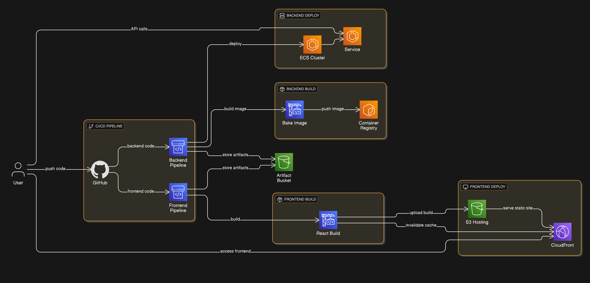
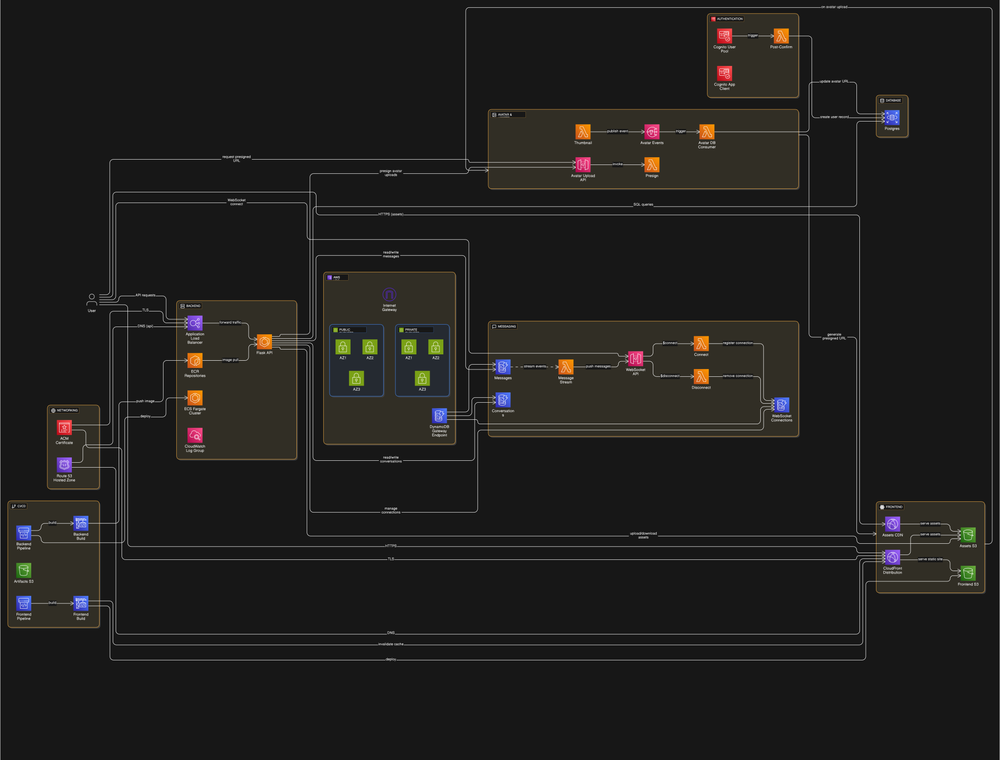

# Cruddur - AWS Bootcamp App

I built this full-stack social app as part of Andrew Brown’s AWS Bootcamp.  
It helped me learn AWS across containers, serverless, databases, CI/CD, and frontend delivery.

## Quick links
- Journal (all weeks): `./journalreadme.md`
- Diagrams folder: `./_docs/diagrams/`
- CloudFormation guide: `./aws/cfn/README.md`
- API spec: `./backend-flask/openapi-3.0.yml`

## Demo
I shut it down to save costs. I’ll bring it back up again soon.

## Key features
- Flask API for activities, messages, likes, and profile updates
- React frontend with AWS Amplify auth and JWTs for API calls
- Cognito user pools for sign-up/sign-in and token verification
- PostgreSQL schema + migrations for user and activity data
- DynamoDB tables for conversations and messages (serverless side)
- WebSocket API + Lambdas for real-time messaging
- S3 + CloudFront for frontend/assets + Lambda-based image processing
- CodeBuild/CodePipeline buildspecs for backend and frontend

## Architecture (high-level)
- React single-page app served from S3 via CloudFront
- Flask API container running on ECS behind an ALB
- RDS PostgreSQL for core app data
- DynamoDB + API Gateway (WebSocket/HTTP) + Lambda for messaging and avatar pipeline
- Cognito for auth, plus S3/SNS for image workflow

### Diagrams
I use multiple diagrams so it’s easier to understand each layer.  
(Where I have both formats, I show the **SVG** because it stays sharp when you zoom.)


#### 01 — Foundation & Networking Layer
- `_docs/diagrams/01-Foundation%20%26%20Networking%20Layer.svg` (preferred)
- `_docs/diagrams/01-Foundation%20%26%20Networking%20Layer.png` (fallback)


#### 02 — Edge + DNS + Frontend Delivery
- `_docs/diagrams/02-dge%20%2B%20DNS%20%2B%20Frontend%20Delivery.png`


#### 03 — Containers, Platform + Backend CI/CD
- `_docs/diagrams/03-Containers,Platform%2BBackendCICD.png`


#### 04 — Serverless + Data + Identity
- `_docs/diagrams/04-Serverless%2BData%2BIdentity.png`


#### CI/CD templates diagram
- `_docs/diagrams/Teamplates-AllCICD.png`



#### Overview (CloudFormation stacks overview, excluding SAM)
- `_docs/diagrams/all%20cfns%20except%20SAM.svg` (preferred)
- `_docs/diagrams/all%20cfns%20except%20SAM.png` (fallback)


#### One big messy diagram (service map)
I also have this diagram:

- `_docs/diagrams/all.svg` (preferred)
- `_docs/diagrams/all.png` (fallback)



It’s one big messy “everything in one picture” diagram. I don’t use it as the main diagram, but it’s useful if you just want to quickly see **all AWS services involved** in the project.

---

## Tech stack
- Python (Flask), JavaScript (React)
- Cognito, API Gateway (HTTP + WebSocket)
- ECS Fargate, ECR, ALB
- RDS PostgreSQL, DynamoDB
- S3, CloudFront, SNS
- AWS SAM + CloudFormation
- Docker, Docker Compose
- CodeBuild, CodePipeline

## Local development

### Prereqs
- Docker + Docker Compose
- Node.js 18 + npm
- Python 3.10

### Setup
```bash
cp backend-flask/.env.example backend-flask/.env.development
cp frontend-react-js/.env.example frontend-react-js/.env.development
````

Fill the placeholders for Cognito, RDS, DynamoDB, and API URLs.

### Run (local)

```bash
docker compose up --build
```

* Frontend: [http://localhost:3000](http://localhost:3000)
* Backend health check: [http://localhost:4567/api/health-check](http://localhost:4567/api/health-check)

### Testing

```bash
cd frontend-react-js && npm test
./backend-flask/db/bin/test
```

## Observability & operations

* OpenTelemetry, X-Ray, and Rollbar are scaffolded but commented out in `backend-flask/app.py`
* ECS task role includes X-Ray permissions in `aws/cfn/backend-service/backend-service.yaml`
* SAM template sets log retention and tracing defaults in `aws/cruddur-serverless/template.yaml`

## Security notes

* Auth uses Cognito + JWT verification in `backend-flask/lib/cognito_jwt_token.py`
* DynamoDB tables are configured with encryption + point-in-time recovery in `aws/cruddur-serverless/template.yaml`
* DB connection values are passed via env vars (no secrets committed)

## What I learned / decisions I made

* I kept the API as one Flask service, but used serverless for messaging/media to avoid coupling everything together
* I used DynamoDB for message streams and RDS for relational user data (different access patterns)
* I split local vs prod configs using `.env` files and separate Dockerfiles
* I broke CloudFormation into multiple stacks (networking/cluster/database/frontend/etc.) so changes stay isolated
* I used buildspecs so backend builds and frontend uploads can run in CI
* I pushed image processing into Lambda + S3 events so the main API stays lighter
* I used Cognito + Amplify so auth/token handling works without building custom auth UI flows

## Roadmap

* Turn on tracing in `backend-flask/app.py` and document the exact steps
* Add backend API tests beyond the current DB scripts

## About the author

I'm UK-based (arrived Sep 2023) and finished an MSc in Data Science at the University of Surrey (Sep 2024). I completed Andrew Brown's AWS Bootcamp and documented the labs and project work here. I'm aiming for a data/ML path (cloud + data engineering / MLOps).

## Contact

* GitHub: [https://github.com/Jawidd/](https://github.com/Jawidd/)
* Email: [jawid00786@gmail.com](mailto:jawid00786@gmail.com)
* LinkedIn: TODO

---

## Deployment (what I actually did)

This is the order I used to deploy the app using the scripts in `./bin/` and the CloudFormation/SAM templates in `./aws/`.

### 0) Quick info (my setup)

* AWS account: `225442939245`
* Region: `eu-west-2`
* Domain: `cruddur.jawid.me`
* API domain: `api.cruddur.jawid.me`
* Cognito User Pool: `eu-west-2_*********`
* Assets bucket: `assets.cruddur.jawid.me`

### 1) Bootstrap (one-time)

Creates the S3 bucket used for CloudFormation artifacts.

```bash
./bin/cfn/bootstrap
```

Outputs (from my setup):

* Artifacts bucket: `cfn-artifacts-jawid-eu-west-2`

### 2) Manual prerequisites (before CloudFormation)

ACM certificates:

* ALB cert (eu-west-2) for: `api.cruddur.jawid.me`
* CloudFront cert (us-east-1) for: `cruddur.jawid.me`
* Validate both using DNS records in Route53

DB password:

```bash
export DB_PASSWORD="your-secure-password"
```

### 3) Infrastructure (CloudFormation stacks)

Deploy everything:

```bash
./bin/cfn/deploy-all
```

Parameters I had to provide:

* Networking: defaults (VPC CIDR 10.0.0.0/16, AZs eu-west-2a/b/c)
* Cluster: ALB certificate ARN (from step 2)
* Database: uses `DB_PASSWORD` from env var
* DNS: domain name + certificate ARNs
* Backend service: needs the ECR image URI (after pushing in step 5)
* Frontend: CloudFront certificate ARN + S3 bucket name

Useful outputs you’ll see:

* Networking: VpcId, PublicSubnetIds, PrivateSubnetIds
* Cluster: ALB DNS name, ECS cluster name
* Database: RDS endpoint, DB security group ID
* DNS: Route53 hosted zone ID
* Backend: ECS service name
* Frontend: CloudFront distribution ID, S3 bucket name

### 4) Serverless components (SAM)

WebSocket + Lambda + DynamoDB for messaging/media.

```bash
cd aws/cruddur-serverless
sam build
sam deploy --guided
```

Parameters I used:

* `CognitoUserPoolId`
* `CognitoUserPoolClientId`
* `AssetsBucketName`: `assets.cruddur.jawid.me`
* `FrontendOrigin`: `https://cruddur.jawid.me`
* `NetworkingStack`: `CrdNet`
* `DatabaseStack`: `CrdDb`

Outputs (examples from my deploy):

* WebSocket API: `wss://e7y93hdkga.execute-api.eu-west-2.amazonaws.com/prod`
* Avatar API: `https://bgc7pnw9rh.execute-api.eu-west-2.amazonaws.com`
* DynamoDB table names (messages, connections, etc.)

### 5) Deploy application code (backend + frontend)

Backend (build + push Docker image to ECR):

```bash
./bin/backend/ecr-ecs/build-backend-prod
./bin/backend/ecr-ecs/tag-push-backend-prod
```

Frontend (build + upload to S3 / CloudFront):

```bash
./bin/frontend/build-and-upload-frontend
```

### 6) Database setup (schema + seed)

```bash
cd backend-flask
./bin/db/schema-load
./bin/db/seed
```

### 7) Post-deploy checks

Health checks:

* Backend: `https://api.cruddur.jawid.me/api/health-check`
* Frontend: `https://cruddur.jawid.me`

WebSocket test:

```bash
node backend-flask/bin/ddb/web-socket-test.js
```

### Dependencies (why the order matters)

* bootstrap → everything else (artifacts bucket)
* networking → cluster/database/backend (VPC/subnets)
* cluster → backend service (ECS + ALB)
* database → backend service (RDS + SG access)
* dns → frontend (cert + hosted zone wiring)
* backend service needs an ECR image
* serverless needs Cognito IDs + networking outputs


